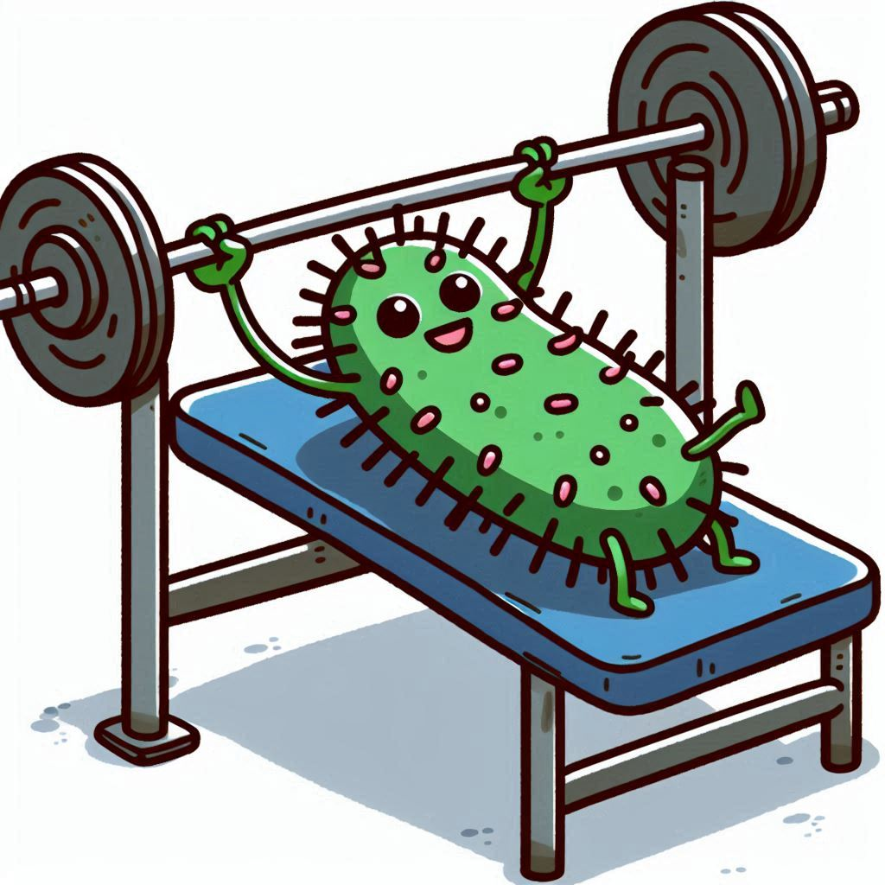

```{r setup, include=FALSE}
knitr::opts_chunk$set(echo = TRUE)
options(scipen = 10)
```

```{r echo=FALSE,warning=FALSE,message=FALSE}
library(readxl)
library(kableExtra)
library(tidyverse)
d<-read_tsv("ENA_data_links.tsv")#read_xlsx("data_links.xlsx")
hic<-read_delim("ena_hic.tsv")
```



# MicroBench 

Overview of our data for microbial genomic benchmarking. We have sequenced a bunch of mono cultures, and metagenomic samples. Data has been deposited to the ENA ([PRJEB85558](https://www.ebi.ac.uk/ena/browser/view/PRJEB85558)). 

Monocultures:

```{r echo=FALSE,message=FALSE,results='asis'}
list_samples <- function(df) {
  # Assuming 'Sample' column contains the monoculture names
  samples <- unique(df$Sample) 

  for (sample in samples) {
    sample_formatted<-sample %>% gsub(pattern=" ",replacement="-") %>% tolower()
    cat(paste0(" * [",sample,"](#",sample_formatted,")"),"\n")
  }
}
list_samples(d %>% filter(SampleType=="monoculture"))
```

Mock Metagenomes:

```{r echo=FALSE,message=FALSE,results='asis'}
list_samples(d %>% filter(SampleType=="mock"))
```

"Real" metagenomes:

```{r echo=FALSE,message=FALSE,results='asis'}
list_samples(d %>% filter(SampleType=="metagenome"))
```

```{r echo=FALSE,message=FALSE,results='asis'}
generate_nanopore_table <- function(df) {
    # Extract relevant information for the current sample
    sample_data <- df %>% 
        arrange(desc(`basecall model version`))

    # Create the markdown output
    cat("###", sample_data$Sample[1], "\n\n")  # Heading with culture name

    # Construct the DSMZ link (assuming a pattern in your data)
    dsmz_link <- sample_data$SampleInfo[1]

    cat("You find a description of this sample here: [",dsmz_link,"](",dsmz_link,")\n")

    # Output the table
    sample_data %>% select(-c(	SampleType,SampleInfo)) %>%
          mutate(fast = case_when(is.na(fast)~NA,
                                  TRUE~cell_spec("fast", "html", link = paste0("http://",fast)))) %>%
          mutate(hac = case_when(is.na(hac)~NA,
                                 TRUE~cell_spec("hac", "html", link = paste0("http://",hac)))) %>%
          mutate(sup = case_when(is.na(sup)~NA,
                                 TRUE~cell_spec("sup", "html", link = paste0("http://",sup)))) %>%
          mutate(hacdup = case_when(is.na(hacdup)~NA,
                                    TRUE~cell_spec("hacdup", "html", link = paste0("http://",hacdup)))) %>%
          mutate(supdup = case_when(is.na(supdup)~NA,
                                    TRUE~cell_spec("supdup", "html", link = paste0("http://",supdup)))) %>%
          mutate(mods = case_when(is.na(mods)~NA,
                                  TRUE~cell_spec("mods", "html", link = paste0("http://",mods))))%>%
          mutate(pod5 = case_when(is.na(pod5)~NA,
                                  TRUE~cell_spec("pod5", "html", link = paste0("http://",pod5)))) %>%
          kable(format="html",escape = F) %>%
          kable_styling(bootstrap_options = c("striped", "hover", "condensed", "responsive" ,"bordered"),
                        full_width=FALSE,  position = "left") %>%
          as.character() %>% cat()
    cat("\n\n")
}
generate_hic_table <- function(df) {
  if (nrow(df) == 0) return(invisible(NULL))

  cat("#### Hi-C data\n\n")

  df %>%
    rename(R1 = 5, R2 = 6) %>%
    select(-sample) %>%
    mutate(R1 = cell_spec("R1", "html", link = paste0("http://", R1))) %>%
    mutate(R2 = cell_spec("R2", "html", link = paste0("http://", R2))) %>%
    kable(format = "html", escape = FALSE) %>%
    kable_styling(bootstrap_options = c("striped", "hover", "condensed", "responsive", "bordered"),
                  full_width = FALSE, position = "left") %>%
    as.character() %>% cat()
  cat("\n\n")
}
```

## Mono cultures

```{r echo=FALSE,message=FALSE,results='asis'}
df <- d %>% filter(SampleType == "monoculture")
# Assuming 'Sample' column contains the monoculture names
monocultures <- unique(df$Sample) 

for (culture in monocultures) {
    generate_nanopore_table(df %>% filter(Sample == culture))
    generate_hic_table(hic %>% filter(sample == culture))
}
```

## Mock metagenomes

```{r echo=FALSE,message=FALSE,results='asis'}
df <- d %>% filter(SampleType == "mock")
# Assuming 'Sample' column contains the monoculture names
mocks <- unique(df$Sample) 

for (mock in mocks) {
    generate_nanopore_table(df %>% filter(Sample == mock))
    generate_hic_table(hic %>% filter(sample == mock))
}
```

## "Real" metagenomes

```{r echo=FALSE,message=FALSE,results='asis'}
df <- d %>% filter(SampleType == "metagenome")
# Assuming 'Sample' column contains the monoculture names
metagenomes <- unique(df$Sample) 

for (metagenome in metagenomes) {
    generate_nanopore_table(df %>% filter(Sample == metagenome))
    generate_hic_table(hic %>% filter(sample == metagenome))
}
```


