README
================
Rasmus Kirkegaard
16 June, 2025

# R10.4.1 Zymo HMW basecalling

## Aim

To check the quality of nanopore data with the ZymoHMW mock DNA.

## Conclusion

There are some serious improvements in raw read accuracy between the
fast, hac sup, and now hyp models. However, for some reason the improved
raw read accuracy of the hyp(er) accuracy model does not improve
assemblies consistently for all of the organisms.

## Data availability

<https://github.com/Kirk3gaard/MicroBench>

## NP reads mapped to the refs overall (percent identity)

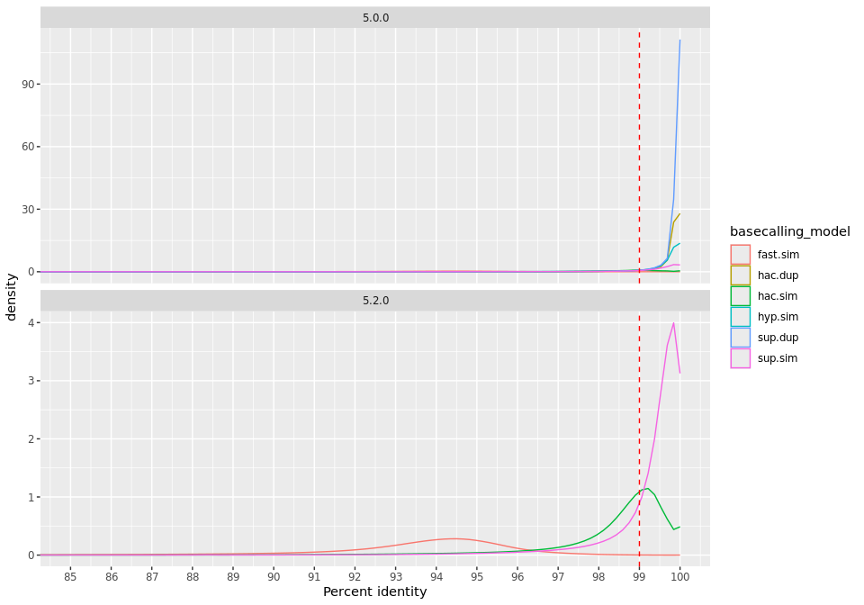<!-- -->

## Longest perfect read

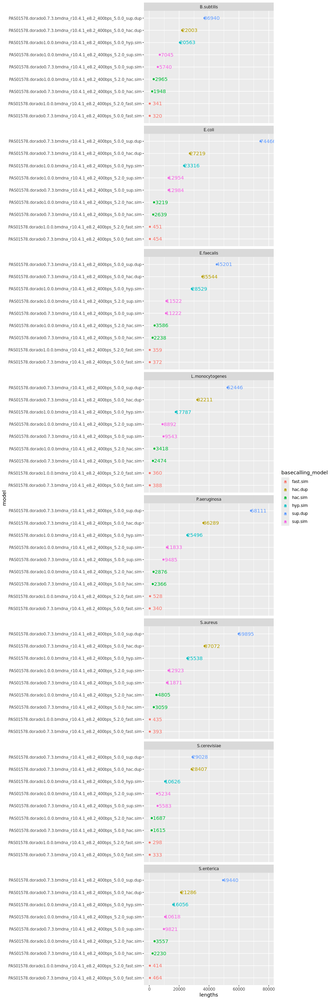<!-- -->

## NP reads mapped to the refs overall (phred scale)

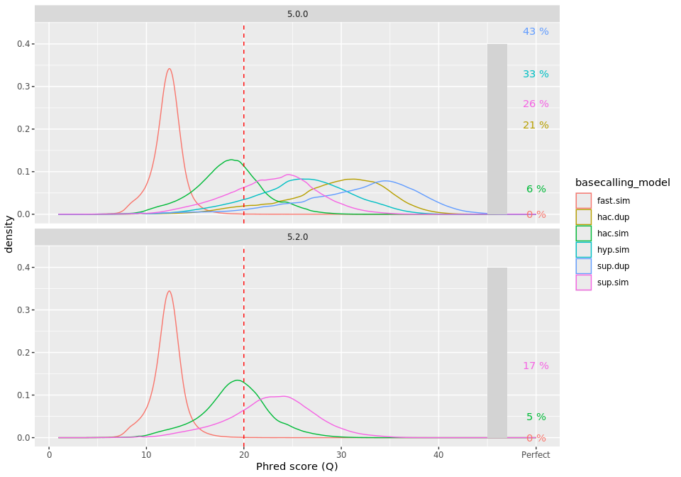<!-- -->

## all modes

### Indel rate vs coverage

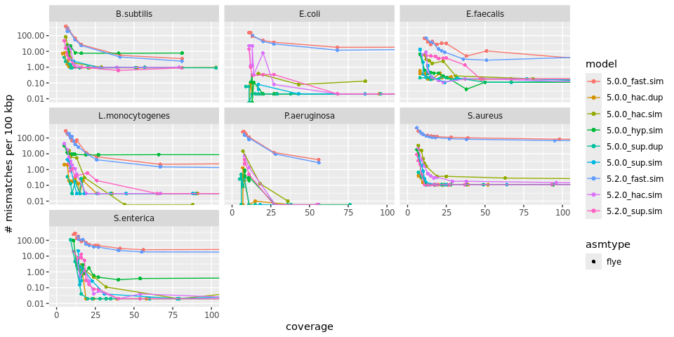<!-- -->

### Mismatch rate vs coverage

<!-- -->

## Fast mode

### Indel rate vs coverage

<!-- -->

### Mismatch rate vs coverage

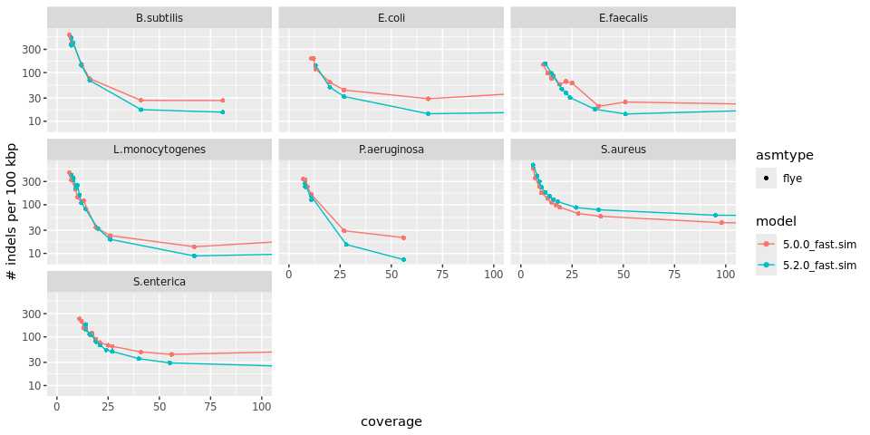<!-- -->

## HAC mode

### Indel rate vs coverage

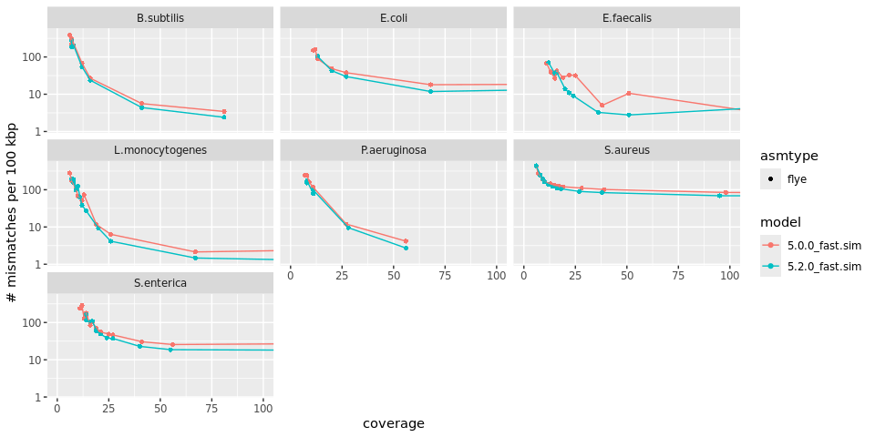<!-- -->

### Mismatch rate vs coverage

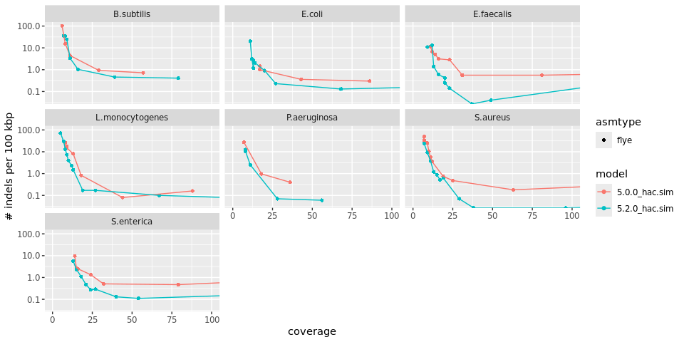<!-- -->

## SUP mode

### Indel rate vs coverage

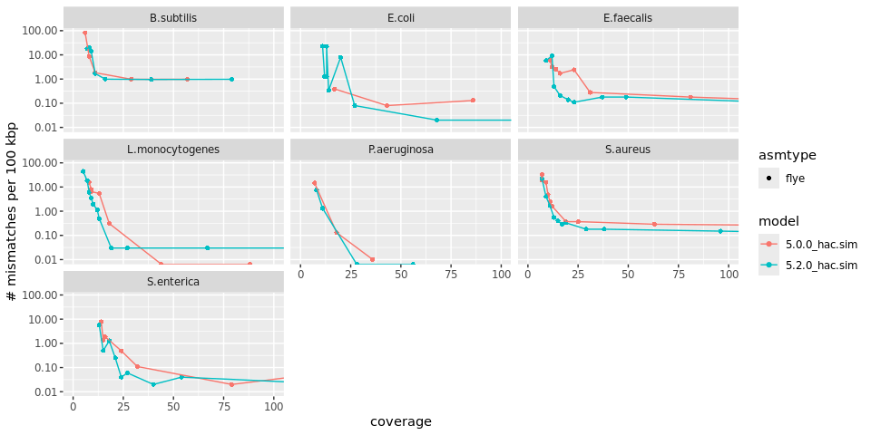<!-- -->

### Mismatch rate vs coverage

<!-- -->

## Duplex mode

### Indel rate vs coverage

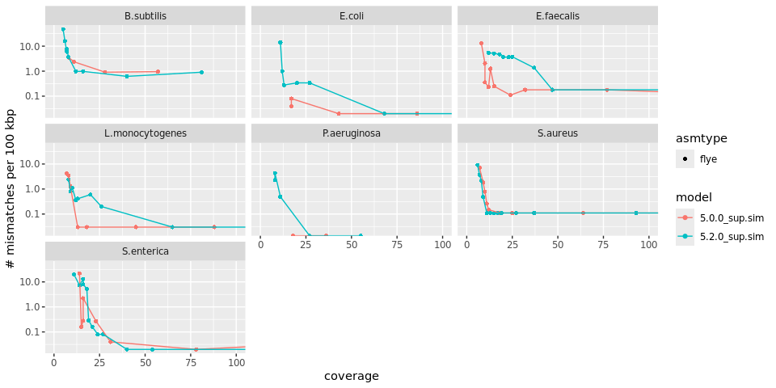<!-- -->

### Mismatch rate vs coverage

<!-- -->

## hyp mode vs sup

### Indel rate vs coverage

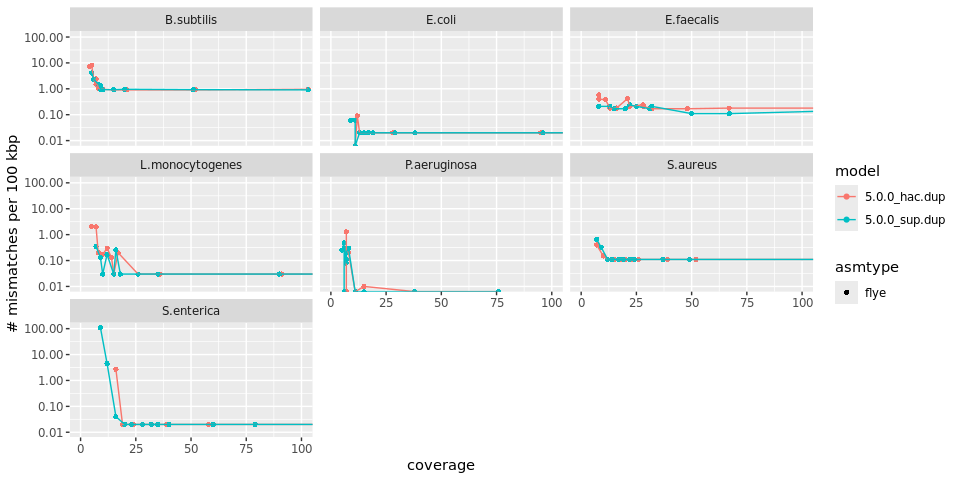<!-- -->

### Mismatch rate vs coverage

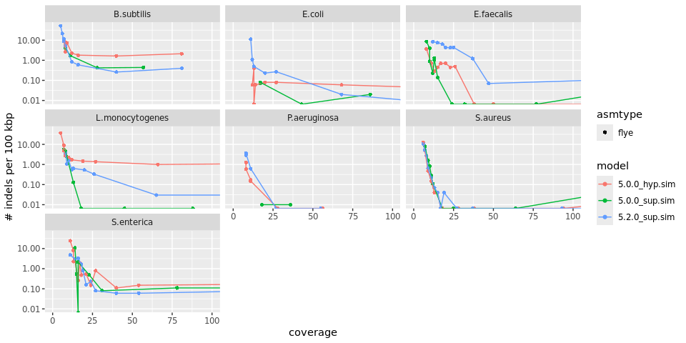<!-- -->

## Materials and methods

Here is a brief description of the tools used. For the exact commands
check out the **Snakefile** in this repository
([Snakemake](https://snakemake.readthedocs.io/en/stable/) v. 7.18.2).

### DNA sequencing

DNA sample was the [Zymo Mock HMW
standard](https://zymoresearch.eu/products/zymobiomics-hmw-dna-standard).
The DNA was prepared for sequencing using the nanopore ligation
sequencing kit (SQK-LSK114) and sequenced on a R10.4.1 nanopore
PromethION flowcell (FLO-PRO114HD) with the “400 bp/s” mode (5khz
sampling).

### Basecalling

#### 5 khz High Duplex PromethION data

The reads were basecalled using
[dorado](https://github.com/nanoporetech/dorado) (v. 0.7.3) with fast,
hac and sup accuracy mode using the 5.0.0 models.The reads were
basecalled using [dorado](https://github.com/nanoporetech/dorado) (v.
1.0.0) with fast, hac and sup accuracy mode using the 5.2.0 models and
hyp model 5.0.0.

### Read QC

Reads were mapped to the updated zymo reference genomes (hopefully goes
public soon) using [minimap2](https://github.com/lh3/minimap2) (v.
2.24), and QC information was obtained using
[NanoPlot](https://github.com/wdecoster/NanoPlot) (v. 1.41.0).

### Assembly

The reads were subsampled using [seqtk](https://github.com/lh3/seqtk)
(v. 1.3) and assembled using [flye](https://github.com/fenderglass/Flye)
(v. 2.9.5).

### Genome quality assessment

The assembled contigs were compared to the reference contigs using
[QUAST](https://github.com/ablab/quast) (v. 5.2.0) and
[fastANI](https://github.com/ParBLiSS/FastANI) (v. 1.33).
